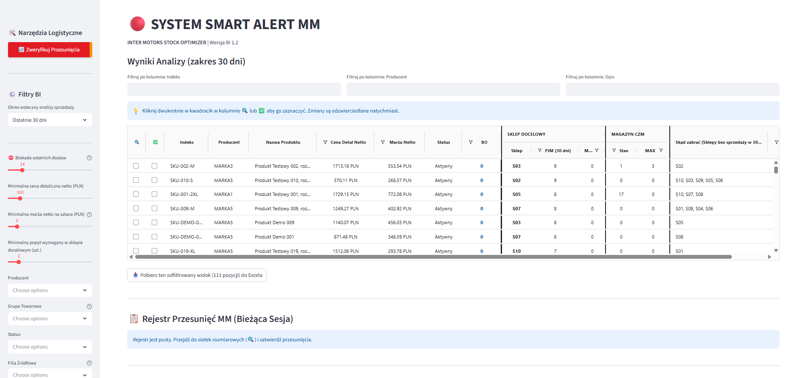

# Smart Alert MM

Inter-store stock transfer ("MM") recommendation tool: finds stock that is sitting
unsold in one store, matches it against real demand in another store that can't be
covered by the central warehouse, and recommends a transfer.

## What it does

- Flags items with stock but zero sales in a configurable lookback window ("zalegający
  towar" / dead stock).
- Matches them against stores with real demand (recent sales) and an empty shelf,
  where the central warehouse doesn't already hold enough free stock to cover it
  through normal replenishment.
- Applies a "karencja" cool-down: stores that recently received the same item through
  an earlier transfer are excluded for a configurable number of days.
- Lets you drill into a single product's full store x size grid, register transfers,
  and export everything to styled Excel reports.

(Example identifiers used anywhere in this README - `SKU-001`, `STORE-A` - are
placeholders, not real product or store codes.)

## Architecture

```
app.py                          # Entry point: page config, screen routing, session_state init
config/
├── constants.py                 # Single source of truth: colors, filenames, business constants
└── styles.py                    # Streamlit CSS injection
core/
├── data_loader.py                # CSV parsing into clean DataFrames
├── recommendation_engine.py       # Pure pandas business logic - zero Streamlit imports
└── excel_export.py               # Shared openpyxl styling helpers
views/
├── main_report.py                # Main screen: BI filters + recommendation grid
├── size_mask.py                  # Store x size grid for a single product model
└── check_sales.py                # Upload-and-verify screen for past transfers
tools/
└── generuj_dane_testowe.py        # Synthetic sample-data generator (see "Sample data" below)
tests/
├── test_recommendation_engine.py
├── test_parity_real_data.py
└── test_excel_export_parity.py
```

Business logic lives separately from the Streamlit UI on purpose: `core` (pure logic,
no Streamlit) can be unit-tested with a plain DataFrame and no running browser session,
while `views` stays a thin layer that just calls into `core` and renders the result.
`config` exists so that colors, filenames, and thresholds have exactly one definition
instead of being copied as literals across files.

## Testing

**Correctness isn't just asserted - it's measured.** A dedicated regression test
replays the previous and current recommendation logic side by side against real
production data and asserts the two outputs are byte-for-byte identical across 6,790
recommended rows in one of its scenarios.

Run everything with:

```bash
pytest tests/ -v
```

- **`test_recommendation_engine.py`** - unit tests for each business rule (basic
  match, same-store exclusion, cool-down blocking, central-warehouse coverage rule,
  price threshold) against small, synthetic DataFrames.
- **`test_parity_real_data.py`** - the parity test described above. It reads real
  company data from a `Smart_MM/` folder next to this project and is **skipped
  automatically** when that folder isn't present (e.g. on a fresh clone, since the
  data is git-ignored) - it never fails just because the data is missing.
- **`test_excel_export_parity.py`** - compares generated Excel files (cell values and
  every style: fonts, fills, borders, column widths, table objects) against a
  known-good reference, on synthetic sample data.

App startup itself is verified with Streamlit's `streamlit.testing.v1.AppTest`, which
runs the script server-side and surfaces any exception without needing a browser.

## Running the app

Requirements:

```bash
pip install streamlit pandas openpyxl streamlit-aggrid pytest
```

The app expects a `Smart_MM/` folder next to `app.py` (i.e. in this project's root) -
see "Sample data" below for what it must contain. Without it, the app shows a waiting
message instead of crashing.

```bash
streamlit run app.py
```

or double-click `Smart Alert MM.bat`.

## Sample data

Company data is never committed to this repository (see `.gitignore`) - if you're
cloning this project, you need to supply your own CSV files with the structure below.

`Smart_MM/stany_surowe.csv` (stock) - required columns:
- `Filia Kod`, `Indeks`, `Nazwa Towaru`, `Magazyn PJM`, `Producent`, `Grupa Towarowa`, `Status`
- optional: `Cena Detaliczna Netto`, `Cena ewidencyjna`, `Waluta Ceny Ewidencyjnej` (enable price/margin filtering when present)

`Smart_MM/sprzedaz_surowa.csv` (sales) - required columns:
- `Indeks`, `Filia Kod`, `Data`, `Sprzedaz PJM`, `Nazwa Towaru`
- optional: `Status`, `Sprzedaz Netto`, `Marza`

`Smart_MM/min_max.csv` (per-store stock targets) - required columns:
- `Indeks`, `Filia Kod`, `MIN MAX`

Two more files are optional and the app degrades gracefully (with a warning) without
them:
- `Smart_MM/rejestr_przesuniec_mm_2025.csv` / `rejestr_przesuniec_mm_2026.csv` (transfer
  history, powers the cool-down rule) - columns: `Filia Kod`, `Indeks`, `Data MM`
- `Smart_MM/dostawy_bo.csv` (incoming purchase orders) - columns: `Indeks`, `Ilość BO`,
  optionally `Termin`

### Generating sample data

`tools/generuj_dane_testowe.py` generates synthetic `stany_surowe.csv`,
`sprzedaz_surowa.csv` and `min_max.csv` files with the exact structure above (generic
store codes, made-up SKUs, random stock/sales/prices - no real data of any kind) and
writes them into the `Smart_MM/` folder the app expects. It also seeds a handful of
`SKU-DEMO-*` items specifically constructed to pass the app's default filters, so the
main screen shows real recommendations on first run instead of an empty table.

```bash
python tools/generuj_dane_testowe.py
```

**This overwrites `stany_surowe.csv`, `sprzedaz_surowa.csv` and `min_max.csv` in
`Smart_MM/`.** If that folder already contains real company data, the script detects it
and asks for explicit confirmation before writing anything (or pass `--force` to skip
the prompt, e.g. in CI). Do not run this against a folder with real data you care about.

## Screenshot

<!-- TODO: add a screenshot or short GIF of the main recommendation screen -->


## Known gaps

- A small Excel-export block in `size_mask.py` (the per-model download button, ~10
  lines) was left outside the `excel_export.py` consolidation - it duplicates a
  bold-header style rather than reusing a shared helper.
